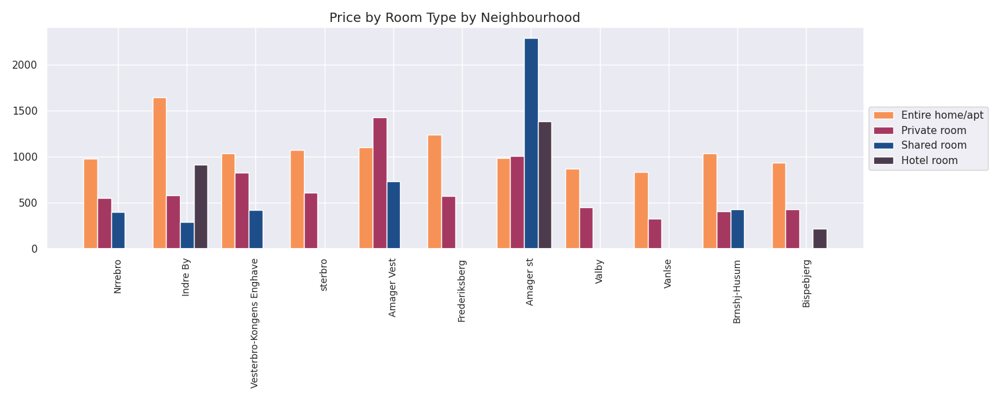
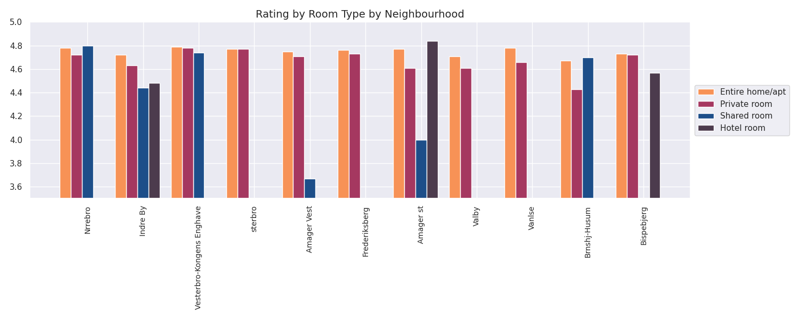
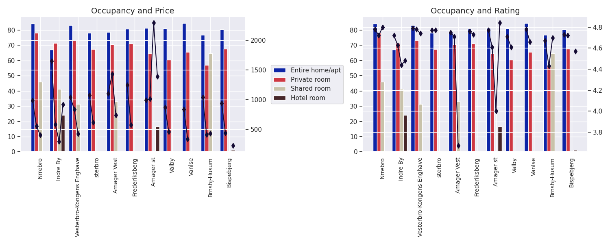

# Set Up

With Python 3.7.0 or greater installed, these are the steps to follow to set up the project.

## Virtual Environment

In order to avoid issues with the dependencies, we set up the virtual environment. To do that run the following command from your terminal while on the root of the project:

`python -m venv venv`

Alternatively, if you have multiple versions of python installed is probably that `python` points to something like Python 2.7 and `python3` points to Python 3.x. In that case run:

`python3 -m venv venv`

Once the virtual environment is set up, activate it by running:

`source venv/bin/activate` (on Linux/MacOS)

`.\venv\Scripts\Activate.ps1` (on Windows)

If successful, you should see a `(venv)` at the beginning of the prompt on your terminal.

After that, upgrade the `pip` version on that virtual environment by running:

`pip install --upgrade pip`

## Install dependencies

The dependencies needed for this project are listed in `requirements.txt`, to install them make sure that you are on the virtual environment and simply run:

`pip install -r requirements.txt`

## Run

While in the virtual environment, run `python main.py` depending on your system.

<<<<<<< HEAD
<<<<<<< HEAD
To start the Jupyter Notebook run `jupyter-lab`.
=======
To start the Jupyter Notebook run `jupyter-lab` and open the `notebook_es.ipynb` by double clicking on it.
>>>>>>> 79049c7e5dc9894cd97acb352f3049ee7dff3a35
=======
To start the Jupyter Notebook run `jupyter notebook` and open the `notebook_es.ipynb`.
>>>>>>> c91ce6fdc9d4c282eb0b8d5fcacdd8a6e3d0c5f3

# Data structure to read (JSON):

```json
{
    "neighbourhood_1": {
        "room_type_1": {
            "occupied_sum": <number>,
            "price_sum": <number>,
            "rating_sum": <number>,
            "counter": <number>
        },
        "room_type_2": {
            "occupied_sum": <number>,
            "price_sum": <number>,
            "rating_sum": <number>,
            "counter": <number>
        },
        "room_type_3": {
            "occupied_sum": <number>,
            "price_sum": <number>,
            "rating_sum": <number>,
            "counter": <number>
        }
    },
    "neighbourhood_2": {
        "room_type_1": {
            "occupied_sum": <number>,
            "price_sum": <number>,
            "rating_sum": <number>,
            "counter": <number>
        },
        "room_type_2": {
            "occupied_sum": <number>,
            "price_sum": <number>,
            "rating_sum": <number>,
            "counter": <number>
        },
        "room_type_3": {
            "occupied_sum": <number>,
            "price_sum": <number>,
            "rating_sum": <number>,
            "counter": <number>
        }
    },
    .
    .
    .
}
```

# Data structure procesed (JSON):

```json

    "neighbourhoods": [
        "neighbourhood_1",
        "neighbourhood_2",
        "neighbourhood_3",
        .
        .
        .
    ],
    "room_type_1_occupancy": [
        <number>,
        <number>,
        <number>,
        .
        .
        .
    ],
    "room_type_1_price": [
        <number>,
        <number>,
        <number>,
        .
        .
        .
    ],
    "room_type_1_rating": [
        <number>,
        <number>,
        <number>,
        .
        .
        .
    ],
    "room_type_2_occupancy": [
        <number>,
        <number>,
        <number>,
        .
        .
        .
    ],
    "room_type_2_price": [
        <number>,
        <number>,
        <number>,
        .
        .
        .
    ],
    "room_type_2_rating": [
        <number>,
        <number>,
        <number>,
        .
        .
        .
    ],
    "room_type_3_occupancy": [
        <number>,
        <number>,
        <number>,
        .
        .
        .
    ],
    "room_type_3_price": [
        <number>,
        <number>,
        <number>,
        .
        .
        .
    ],
    "room_type_3_rating": [
        <number>,
        <number>,
        <number>,
        .
        .
        .
    ],
    .
    .
    .

```

# Questions

## What is the average price for each room type on each neighbourhood?

In our code, this is the call needed to generate a graphic response to this question:

```python
title = 'Price by Room Type by Neighbourhood'
y = 'price'
_plot_question_one_and_two(neighbourhoods, room_types, y, title, elegant_color_palette)
```



We can see the distribution of prices by room type and neighbourhood throughout Copenhagen.

This is a more detailed view for the call to generate the previous chart:

```python
def _plot_question_one_and_two(neighbourhoods: List[str], room_types: List[str], y: str, title: str, color_list: List[str]):
    sns.set()

    x = np.arange(len(neighbourhoods))
    width = 0.20
    normalized_room_types = normalize_str_list(room_types)

    fig, ax = plt.subplots()
    color_palette = iter(color_list)
    _plot_bars(normalized_room_types, color_palette, [ax], x, width, y)

    ax.set_title(title, fontsize = 14)
    ax.set_xticks(x, neighbourhoods, rotation = 90, fontsize = 10)
    ax.legend(loc='center left', bbox_to_anchor = (1, 0.5), fancybox = True, ncol = 1)

    if y == 'rating':
        ax.set_ylim([3.5, 5])

    fig.set_figheight(6)
    fig.set_figwidth(15)
    fig.tight_layout()

    plt.show()
```

## What is the average rating for each room type on each neighbourhood?

In our code, this is the call needed to generate a graphic response to this question:

```python
title = 'Rating by Room Type by Neighbourhood'
y = 'rating'
_plot_question_one_and_two(neighbourhoods, room_types, y, title, elegant_color_palette)
```



We can see the distribution of ratings by room type and neighbourhood throughout Copenhagen.

This is a more detailed view for the call to generate the previous chart:

```python
def _plot_question_one_and_two(neighbourhoods: List[str], room_types: List[str], y: str, title: str, color_list: List[str]):
    sns.set()

    x = np.arange(len(neighbourhoods))
    width = 0.20
    normalized_room_types = normalize_str_list(room_types)

    fig, ax = plt.subplots()
    color_palette = iter(color_list)
    _plot_bars(normalized_room_types, color_palette, [ax], x, width, y)

    ax.set_title(title, fontsize = 14)
    ax.set_xticks(x, neighbourhoods, rotation = 90, fontsize = 10)
    ax.legend(loc='center left', bbox_to_anchor = (1, 0.5), fancybox = True, ncol = 1)

    if y == 'rating':
        ax.set_ylim([3.5, 5])

    fig.set_figheight(6)
    fig.set_figwidth(15)
    fig.tight_layout()

    plt.show()
```

## What is the average occupancy for each room type on each neighbourhood and how it relates to the prices and ratings?

In our code, this is the call needed to generate a graphic response to this question:

```python
_plot_question_three(neighbourhoods, room_types, messi_color_palette)
```



We can see the distribution of occupancy by room type and neighbourhood throughout Copenhagen and how that correlates with the prices and ratings.

This is a more detailed view for the call to generate the previous chart:

```python
def _plot_question_three(neighbourhoods: List[str], room_types: List[str], color_list: List[str]):
    sns.set()

    x = np.arange(len(neighbourhoods))
    width = 0.20
    normalized_room_types = normalize_str_list(room_types)

    fig, axs = plt.subplots(1, 2)
    twinxs = [axs[0].twinx(), axs[1].twinx()]
    ytwinxs = ['price', 'rating']
    color_palette = iter(color_list)
    twinx_color = '#140b34'

    _plot_bars(normalized_room_types, color_palette, [axs[0], axs[1]], x, width, 'occupancy')
    _plot_scatters(normalized_room_types, twinx_color, twinxs, x, ytwinxs, width)
    _plot_lines(neighbourhoods, normalized_room_types, twinx_color, twinxs, x, ytwinxs, width)

    axs[0].set_title('Occupancy and Price', fontsize = 14)
    axs[0].set_xticks(x, neighbourhoods, rotation = 90, fontsize = 10)
    axs[0].legend(loc='center left', bbox_to_anchor = (1.1, 0.5), fancybox = True, ncol = 1)

    axs[1].set_title('Occupancy and Rating', fontsize = 14)
    axs[1].set_xticks(x, neighbourhoods, rotation = 90, fontsize = 10)

    fig.set_figheight(6)
    fig.set_figwidth(15)
    fig.tight_layout()

    plt.show()
```
